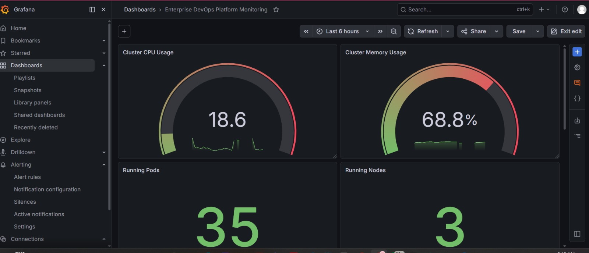
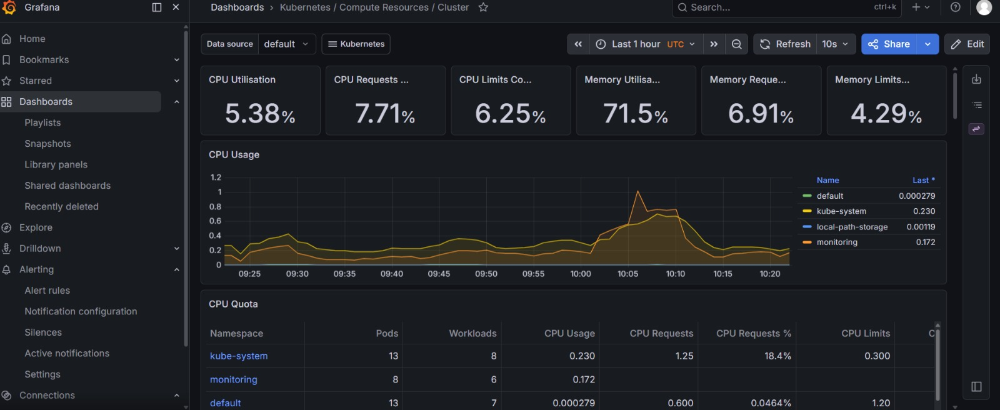
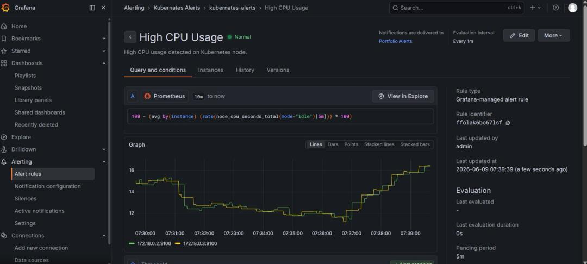
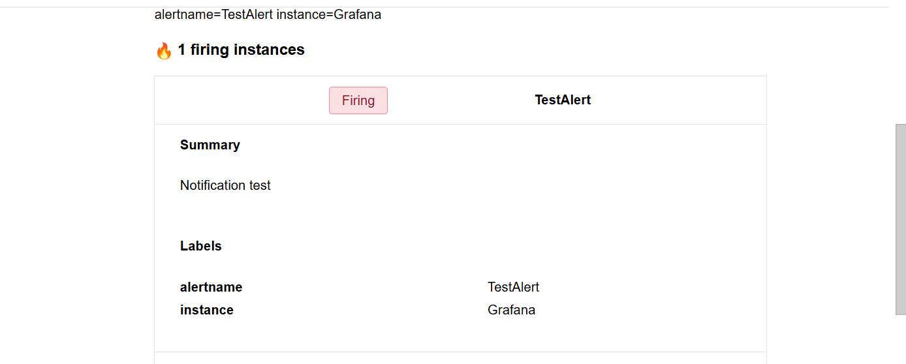

# Kubernetes Observability Stack

## Overview

This project demonstrates the deployment of a production-ready Kubernetes observability platform using Prometheus, Grafana, Alertmanager, and Gmail SMTP notifications.

The objective was to build a complete monitoring and alerting solution capable of collecting cluster metrics, visualizing infrastructure performance, and sending real-time email alerts whenever predefined thresholds are exceeded.

The solution was deployed on Kubernetes using the kube-prometheus-stack Helm chart and validated through end-to-end alert testing.

---

## Architecture

```text
Kubernetes Cluster
        │
        ▼
   Prometheus
(Metrics Collection)
        │
        ▼
     Grafana
(Visualization)
        │
        ▼
  Alertmanager
(Alert Routing)
        │
        ▼
 Gmail SMTP
        │
        ▼
 Email Notifications
```

---

## Technologies Used

- Kubernetes
- Helm
- Prometheus
- Grafana
- Alertmanager
- Gmail SMTP
- Linux
- Git
- GitHub

---

## Features

### Metrics Collection

Prometheus continuously scrapes metrics from:

- Kubernetes API Server
- Nodes
- Pods
- Namespaces
- Cluster Services

### Visualization

Grafana dashboards provide visibility into:

- CPU Utilization
- Memory Utilization
- Cluster Health
- Namespace Performance
- Workload Metrics
- Kubernetes Resource Usage

### Alerting

Alertmanager was configured to:

- Process alert rules
- Route notifications
- Send email alerts through Gmail SMTP

### Email Notifications

Real-time email alerts are delivered whenever configured alert conditions are triggered.

---

## Deployment Steps

### Add Helm Repository

```bash
helm repo add prometheus-community https://prometheus-community.github.io/helm-charts
helm repo update
```

### Create Monitoring Namespace

```bash
kubectl create namespace monitoring
```

### Install kube-prometheus-stack

```bash
helm install monitoring prometheus-community/kube-prometheus-stack \
  --namespace monitoring
```

### Verify Deployment

```bash
kubectl get pods -n monitoring
```

### Access Grafana

```bash
kubectl port-forward svc/monitoring-grafana 3000:80 -n monitoring
```

Access:

http://localhost:3000

---

## Alertmanager Configuration

Configured Alertmanager to:

- Route alerts
- Define notification receivers
- Integrate Gmail SMTP
- Deliver email notifications

---

## Grafana Dashboards

The deployment includes dashboards for:

- Kubernetes Cluster Overview
- Compute Resources
- Namespaces
- API Server Metrics
- CoreDNS Monitoring
- Alertmanager Monitoring

---

## Validation

### Monitoring Validation

Verified:

- Prometheus targets are healthy
- Metrics are being collected
- Dashboards display live cluster metrics

### Alert Validation

Created and triggered test alerts.

Confirmed:

- Alert entered FIRING state
- Alertmanager processed notification
- Email notification delivered successfully

---

## Project Screenshots

### Grafana Dashboard



### Kubernetes Cluster Metrics



### Alert Rule Configuration



### Email Alert Notification



---

## Skills Demonstrated

- Kubernetes Administration
- Cluster Monitoring
- Infrastructure Observability
- Prometheus Configuration
- Grafana Dashboarding
- Alertmanager Configuration
- SMTP Integration
- Incident Monitoring
- Linux Operations
- Helm Package Management
- Git & GitHub

---

## Business Value

This solution enables engineering teams to:

- Detect issues proactively
- Monitor cluster performance in real time
- Reduce mean time to detection (MTTD)
- Improve platform reliability
- Receive automated operational alerts

---

## Author

**Nkechi Ogbuji**

Cloud & DevOps Engineer

AWS | Azure | Kubernetes | Terraform | CI/CD | Observability | AI Automation